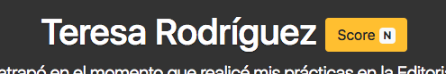
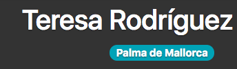

# Web Page Generator Kata

## Description:
### Context
We currently have system that generates static web pages for our website. One of those pages is the Users Biography page where it is displayed valuable information about our registered users.

### Business requirements
They have hired us to add new features to the Users Biography page:

#### 1) Score label
 


This label includes a counter that counts how many keywords appear in the biography.

The list of keywords that we are interested in is:
- edición
- sociedad
- mundo
- libro
- texto
- revista
- valores
- educación
- teatro
- social

The html code that we could use could be:

```html
  <button type="button" class="btn btn-warning">Score <span class="badge badge-light">N</span><span class="sr-only">keywords found</span></button>";
```

#### 2) Localization label



Our company has 5 offices around Spain: Barcelona, Madrid, Granada, Vigo and Palma de Mallorca.
We want to display a label with the name of the city if it appears in the biography.

A possible design could be:

```html
  <span class="badge badge-pill badge-info">Madrid</span>
```

#### 3) Special label "Community manager"


We want to display a special label titled "Community manager" if this text appears in the bio.

```html
  <span class="badge badge-pill badge-danger">Community manager</span>
```

#### 4) Bonus task 

if we end up the development and still have more time they have asked us to add an extra feature that will be gladly rewarded.

In this bonus feature we should create a backup file apart from the automatic generated one. Thus the manager can keep an historic of the generated pages.

## Goals
- **Practice the sprout class technique** to avoid adding more complexity to the current classes
- **Practice the wrap method/class technique** in the bonus task to encapsulate the current logic and add a the new feature

## Authors
Luis Rovirosa [@luisrovirosa](https://www.twitter.com/luisrovirosa)

Jordi Anguela [@jordianguela](https://www.twitter.com/jordianguela)
